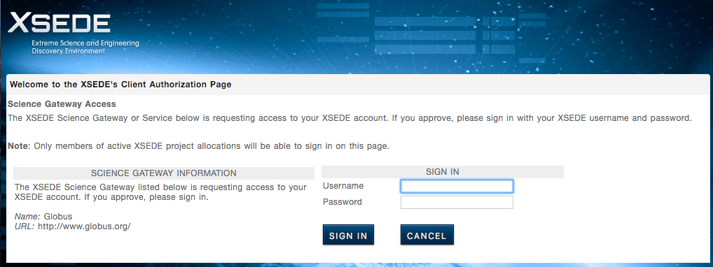
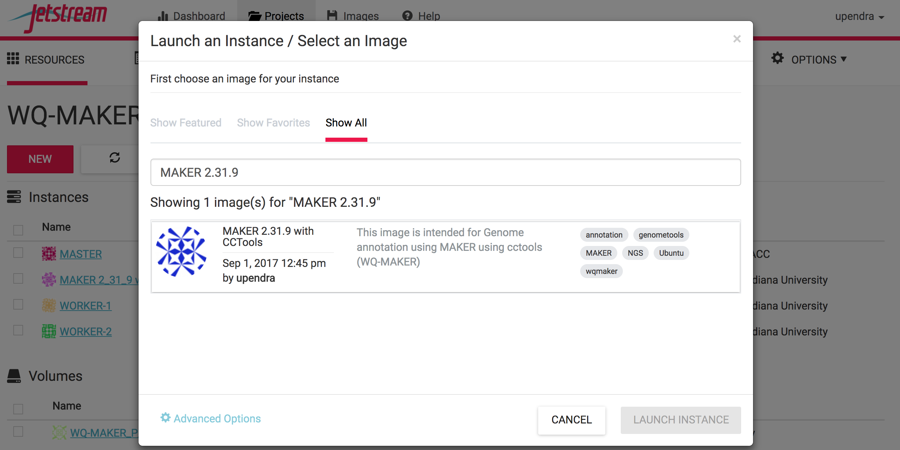
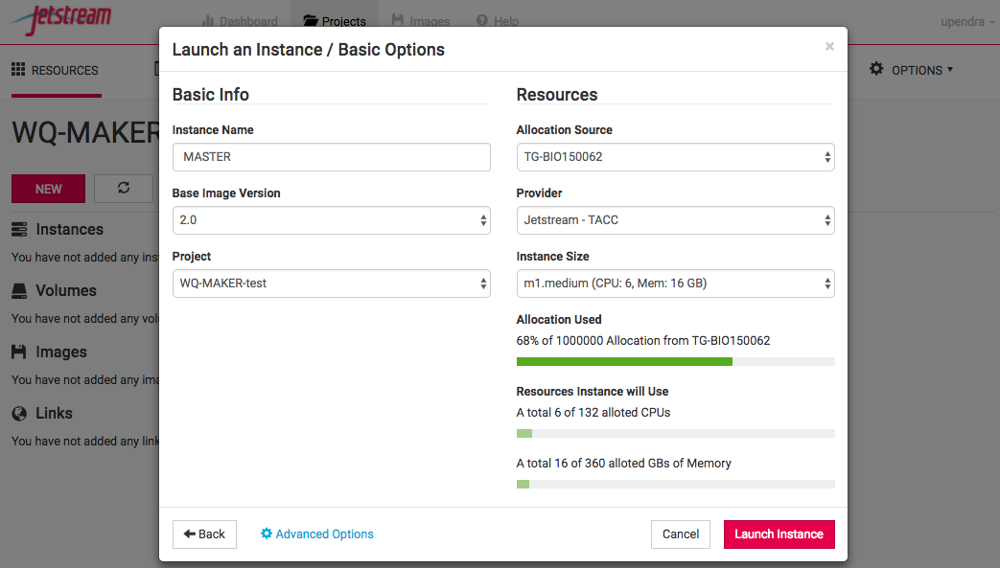
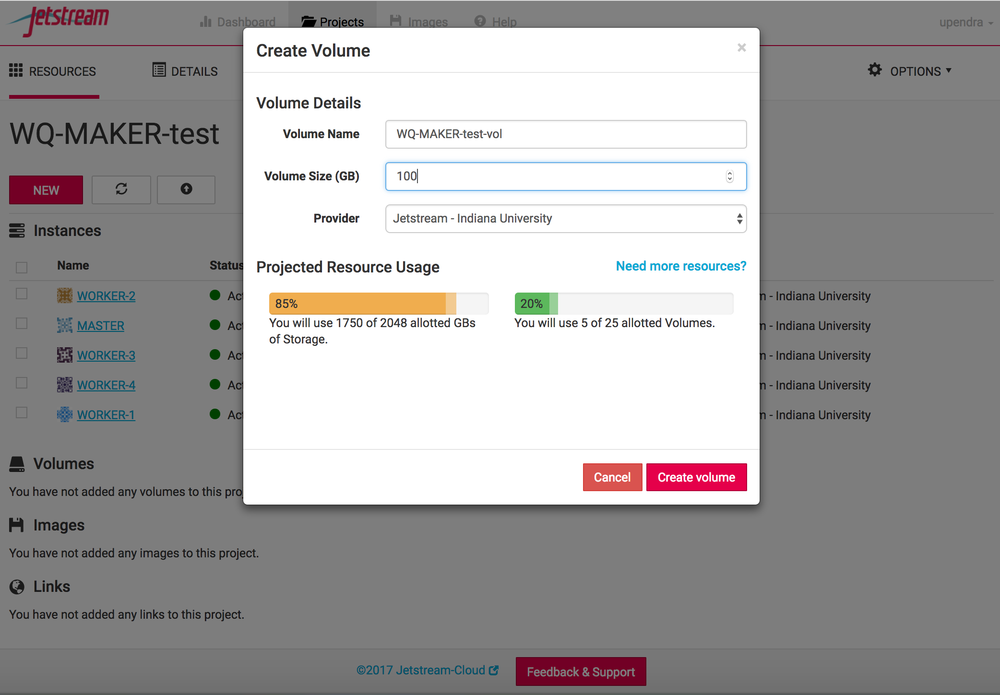
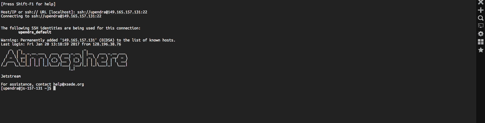
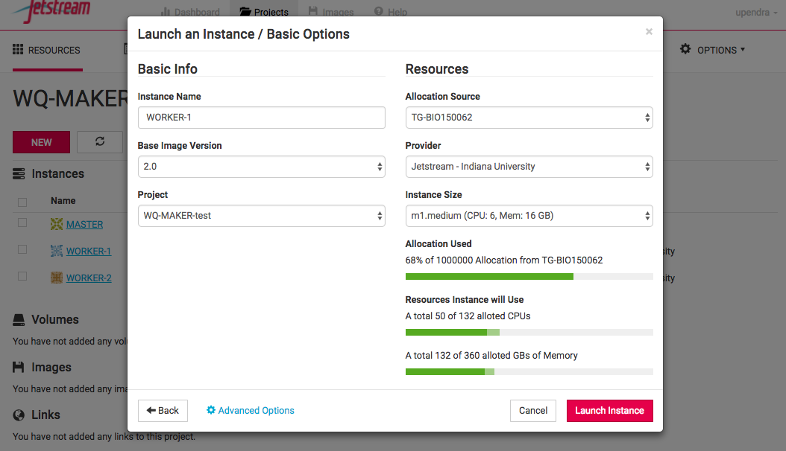
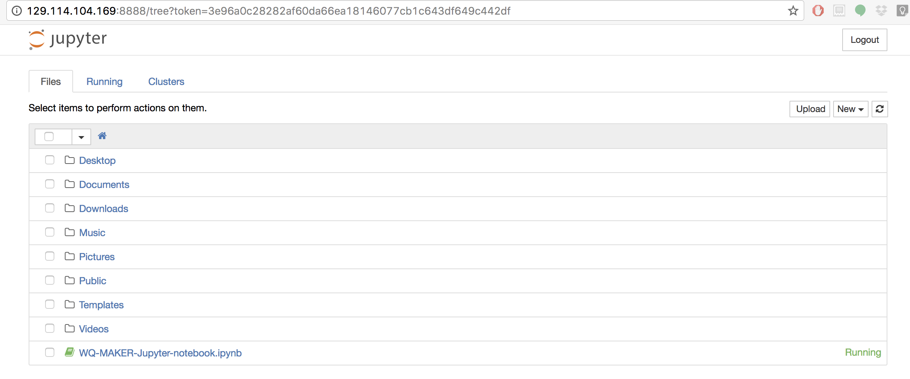

.. include:: cyverse_rst_defined_substitutions.txt

|CyVerse logo|_

|Home_Icon|_
`Learning Center Home <http://learning.cyverse.org/>`_

**MAKER Genome Annotation using cc-tools and Jetstream(WQ-MAKER)**
==================================================================

Rationale and background:
-------------------------
MAKER is a flexible and scalable genome annotation pipeline that automates the many steps necessary for the detection of protein coding genes (Campbell et al. 2013). MAKER identifies repeats, aligns ESTs and proteins to a genome, produces ab initio gene predictions, and automatically synthesizes these data into gene annotations having evidence-based quality indices.  MAKER was developed by the Yandell Lab and is described in several publications (Cantarel et al. 2008; Holt & Yandell 2011).  Additional background is available at the MAKER Tutorial at GMOD and is highly recommended reading.

MAKER with CCTools (aka WQ-MAKER) is a modified MAKER annotation tools capable of running MAKER on distributed computing resources such as Jetstream cloud (Thrasher et al., 2012). Using the work-queue platform, users can now run MAKER across multiple virtual machines to achieve a several fold reduction in the duration of the MAKER run.

This tutorial will take users through steps of:

1. Running WQ-MAKER on Jetstream cloud
2. Running WQ-MAKER on an example genome assembly data

Considerations
--------------
**Sounds great, what do I need to get started?**

1. Jetstream allocation. If you don't have one, you can send in your request to add you to CyVerse's JS allocation through the intercom (button on the bottom right on this page).
2. XSEDE account
3. Your data (or you can run example data)

**What kind of data do I need?**
--------------------------------

1. Mandatory Requirements

 1.1 Genome assembly(fasta file)

 1.2 Organism Type

   1.2.1 Eukaryotic(default, set as: organism_type=eukaryotic)
   1.2.2 Prokaryotic(default, set as: organism_type=prokaryotic)

2. Additional data that can be used to improve the annotation (Highly recommended)
 2.1 RNA evidence (at least one of them is needed)
   2.1.1 Assembled mRNA-seq transcriptome (fasta file)
   2.1.2 Expressed sequence tags (ESTs) data (fasta file)
   2.1.3 Aligned EST or transcriptome GFF3 from your organism
   2.1.4 Aligned EST or transcriptome GFF3 from a closely related organism
 2.2 Protein evidence
   2.2.1 protein sequence file in fasta format (i.e. from multiple organisms)
   2.2.2 protein gff (aligned protein homology evidence from an external GFF3 file)

**What kind of resources will I need for my project?**
------------------------------------------------------
1. Enough storage space on the WQ-MAKER Jetstream instance for both input and output files
 1.1 Creating and mounting an external volume to the running WQ-MAKER MASTER instance would be recommended

2. One Master and several workers needed for running your computation
 2.1 Benchmarking results for data sets can help you estimate the number of workers need for running your annotation

3. Enough AUs to run your computation

**Part 1: Connect to an instance of an WQ-MAKER Jetstream Image (virtual machine)**

Step 1: Go to https://use.jetstream-cloud.org/application and log in with your XSEDE credentials.

|WQ-Maker1|

|WQ-Maker2|

|WQ-Maker3|

Step 2: Click on the "Create New Project"  in the Project tab on the top and enter the name of the project and a brief description

|WQ-Maker4|

|WQ-Maker5|

Step 3:  Launch an instance from the selected image and name it as MASTER

After the project has been created and entered inside it, click the "New" button, select "MAKER 2.31.9 with CCTools" image and then click Launch instance. In the next window (Basic Info),

|WQ-Maker6|

     3.1 name the instance as "MASTER" (don't worry if you forgot to name the instance at that point, as you can always modify the name of the instance later)
     3.2 set base image version as "2.0" (default)
     3.3 leave the project as it is or change to a different project if needed
     3.4 select "Jetstream - Indiana University or Jetstream - TACC" as Provider and click 'Continue'. Your choice of provider will depend on the resources you have available (AUs) and the needs of your instance
     3.5 select "m1.medium" as Instance size (this is the minimum size that is required by WQ-MAKER image) and click "Continue".

|WQ-Maker7|

Step 4: As the instance is launched behind the scenes, you will get an update as it goes through each step.

Status updates of Instance launch (both MASTER and WORKER) include Build-requesting launch, Build-networking, Build-spawning, Active-networking, Active-deploying. Depending on the usage load on Jetstream, it can take anywhere from 2-5 mins for an instance to become active. You can force check updates by using the refresh button in the Instance launch page or the refresh button on your browser. Once the instance becomes active a virtual machine with the ip address provided will become available for you to connect to. This virtual machine will have all the necessary components to run WQ-MAKER and test files to run a MAKER demo.

|WQ-Maker8|

Step 5: Create a volume

Since the m1 medium instance size (60GB disk space) selected for running MASTER instance of WQ-MAKER may not be sufficient for most of the MAKER runs, it is recommended to run it on volumes

5.1 Click the "New" button in the project and select "Create Volume". Enter the name of the volume, volume size (GB) needed and the provider (TACC or Indiana) and finally click "Create Volume"

|WQ-Maker9|

Attach the created volume to the MASTER Instance

|WQ-Maker10|

5.2 Click on the MASTER instance now

|WQ-Maker11|

Jetstream provides web-shell, a web based terminal, for accessing your VM at the command line level once its been deloyed.

|WQ-Maker12|

However, you might find that you wish to access your VM via SSH if you’ve provisioned it with a routable IP number. For SSH access, you can create (or copy) SSH public-keys for your non-Jetstream computer that will allow it to access Jetstream then deposit those keys in your Atmosphere settings. More instructions can be found here

.. code-block:: bash
    $ ssh <username>@<ipaddress>

Step 6: Add public SSH key of MASTER to Jetstream

If you do not already have a ~/.ssh/id_rsa.pub file, then run this command to create it. Use all the defaults..

.. code-block:: bash
    $ ssh-keygen
    Generating public/private rsa key pair.
    Enter file in which to save the key (/home/upendra/.ssh/id_rsa):
    Enter passphrase (empty for no passphrase):
    Enter same passphrase again:
    Your identification has been saved in /home/upendra/.ssh/id_rsa.
    Your public key has been saved in /home/upendra/.ssh/id_rsa.pub.
    The key fingerprint is:
    SHA256:fPvsPyvtcWKl9kQotmJskFljlHQNCNP2pITigdLS3mM upendra@js-157-180.jetstream-cloud.org
    The key's randomart image is:
    +---[RSA 2048]----+
    |   o .  o=oooo   |
    |  o + o .o*.. .  |
    |   + o o o++     |
    |    . E. =...  . |
    |     . .S . o . o|
    |         + o o + |
    |          * ..* o|
    |         o +.oo* |
    |           .+++o.|
    +----[SHA256]-----+

Copy the public SSH key from your id_rsa.pub file and paste it to the https://use.jetstream-cloud.org/application/settings, give a name (MASTER) to it and click confirm.

.. code-block:: bash
    cat ~/.shh/id_rsa.pub

|WQ-Maker13|

Step 7: Launch WORKER instances from MAKER 2.31.9 with CCTools image

Launch one to several instances from the MAKER 2.31.9 with CCTools image and name them as WORKER-1, WORKER-2 etc.,

|WQ-Maker14|

**Part 3: Set up a MAKER run using the Terminal window. Instead IF you want to run the WQ-MAKER using Jupyter notebook please see the section below **

Step 1:  Navigate to the mounted volume.

Once you have logged in to your instance using webshell or ssh of your MASTER instance, you must change the directory permissions as below

.. code-block:: bash
    #Change the ownership and group permission on the mount location
    $ sudo chown -hR $USER /vol_b
    $ sudo chgrp -hR $USER /vol_b

    # cd into the /vol_b and then run WQ-MAKER in there
    $ cd /vol_b

Step 2: Get oriented. You will find staged example data in "/opt/WQ-MAKER_example_data/" within the MASTER instance.  List its contents with the ls command:

.. code-block:: bash
    $ ls /opt/WQ-MAKER_example_data/
    maker_bopts.ctl  maker_exe.ctl  maker-hosts  maker_opts.ctl  test_data  worker-launch.yml

    $ ls /opt/WQ-MAKER_example_data/test_data
    mRNA.fasta  msu-irgsp-proteins.fasta  Os-rRNA.fa  plant_repeats.fasta  test_genome_chr1.fasta  test_genome.fasta

2.1 maker_*.ctl file are a set of configuration files that can be used for this exercise or generated as described below.
2.2 worker-launch.yml and maker-hosts are ansible-playbook and host file for luanching jobs on WORKERS (optional for WQ-MAKER)
2.3 fasta files include a scaled-down genome (test_genome.fasta) which is comprised of the first 300kb of 12 chromosomes of rice and scaled-down genome (test_genome_chr1.fasta) which is comprised of the first 300kb of first chromosome of rice
2.4 mRNA sequences from NCBI (mRNA.fasta)
2.5 publicly available annotated protein sequences of rice (MSU7.0 and IRGSP1.0) - msu-irgsp-proteins.fasta
2.6 collection of plant repeats (plant_repeats.fasta)
2.7ribosomal RNAsequence of rice (Os-rRNA.fa)

Executables for running MAKER are located in /opt/maker/bin and /opt/maker/exe:

.. code-block:: bash
    $ ls /opt/maker/bin/
    cegma2zff       fasta_tool         maker           maker_functional        map_fasta_ids
    chado2gff3      genemark_gtf2gff3  maker2chado     maker_functional_fasta  map_gff_ids
    compare         gff3_merge         maker2eval_gtf  maker_functional_gff    mpi_evaluator
    cufflinks2gff3  iprscan2gff3       maker2jbrowse   maker_map_ids           mpi_iprscan
    evaluator       iprscan_wrap       maker2wap       map2assembly            tophat2gff3
    fasta_merge     ipr_update_gff     maker2zff       map_data_ids

As the names suggest the "/opt/maker/bin" directory includes many useful auxiliary scripts.  For example cufflinks2gff3 will convert output from an RNA-seq analysis into a GFF3 file that can be used for input as evidence for WQ-MAKER. RepeatMasker, augustus, blast, exonerate, and snap are programs that MAKER uses in its pipeline.  We recommend reading MAKER Tutorial at GMOD for more information about these.

Step 3: Set up a WQ-MAKER run.  Create a working directory called "maker_run" on your home directory using the mkdir command and use cd to move into that directory:

.. code-block:: bash
    # Navigate to the mounted volume for creating test directory
    $ cd /vol_b
    $ mkdir wq_maker_run
    $ cd wq_maker_run

Step 4: Copy the contents of  "WQ-MAKER_example_data" into the current directory using cp -r command.  Verify using the ls command.  Change the permissions on that directory

.. code-block:: bash
    $ sudo cp -r /opt/WQ-MAKER_example_data/test_data .

Step 5: Run the maker command with the --help flag to get a usage statement and list of options:

.. code-block:: bash
    $ maker -h
    Argument "2.53_01" isn't numeric in numeric ge (>=) at /usr/local/lib/x86_64-linux-gnu/perl/5.22.1/forks.pm line 1570.
    MAKER version 2.31.9
    Usage:
     maker [options] <maker_opts> <maker_bopts> <maker_exe>
    Description:
     MAKER is a program that produces gene annotations in GFF3 format using
     evidence such as EST alignments and protein homology. MAKER can be used to
     produce gene annotations for new genomes as well as update annotations
     from existing genome databases.
     The three input arguments are control files that specify how MAKER should
     behave. All options for MAKER should be set in the control files, but a
     few can also be set on the command line. Command line options provide a
     convenient machanism to override commonly altered control file values.
     MAKER will automatically search for the control files in the current
     working directory if they are not specified on the command line.
     Input files listed in the control options files must be in fasta format
     unless otherwise specified. Please see MAKER documentation to learn more
     about control file  configuration.  MAKER will automatically try and
     locate the user control files in the current working directory if these
     arguments are not supplied when initializing MAKER.
     It is important to note that MAKER does not try and recalculated data that
     it has already calculated.  For example, if you run an analysis twice on
     the same dataset you will notice that MAKER does not rerun any of the
     BLAST analyses, but instead uses the blast analyses stored from the
     previous run. To force MAKER to rerun all analyses, use the -f flag.
     MAKER also supports parallelization via MPI on computer clusters. Just
     launch MAKER via mpiexec (i.e. mpiexec -n 40 maker). MPI support must be
     configured during the MAKER installation process for this to work though
    Options:
     -genome|g <file>    Overrides the genome file path in the control files
     -RM_off|R           Turns all repeat masking options off.
     -datastore/         Forcably turn on/off MAKER's two deep directory
      nodatastore        structure for output.  Always on by default.
     -old_struct         Use the old directory styles (MAKER 2.26 and lower)
     -base    <string>   Set the base name MAKER uses to save output files.
                         MAKER uses the input genome file name by default.
     -tries|t <integer>  Run contigs up to the specified number of tries.
     -cpus|c  <integer>  Tells how many cpus to use for BLAST analysis.
                         Note: this is for BLAST and not for MPI!
     -force|f            Forces MAKER to delete old files before running again.
                         This will require all blast analyses to be rerun.
     -again|a            recaculate all annotations and output files even if no
                         settings have changed. Does not delete old analyses.
     -quiet|q            Regular quiet. Only a handlful of status messages.
     -qq                 Even more quiet. There are no status messages.
     -dsindex            Quickly generate datastore index file. Note that this
                         will not check if run settings have changed on contigs
     -nolock             Turn off file locks. May be usful on some file systems,
                         but can cause race conditions if running in parallel.
     -TMP                Specify temporary directory to use.
     -CTL                Generate empty control files in the current directory.
     -OPTS               Generates just the maker_opts.ctl file.
     -BOPTS              Generates just the maker_bopts.ctl file.
     -EXE                Generates just the maker_exe.ctl file.
     -MWAS    <option>   Easy way to control mwas_server for web-based GUI
                              options:  STOP
                                        START
                                        RESTART
     -version            Prints the MAKER version.
     -help|?             Prints this usage statement.

Step 6: Create control files that tell MAKER what to do. Three files are required:
 6.1 maker_opts.ctl - gives location of input files (genome and evidence) and sets options that affect MAKER behavior
 6.2 maker_exe.ctl - gives path information for the underlying executables.
 6.3 maker_bopt.ctl - sets parameters for filtering BLAST and Exonerate alignment results

To create these files run the maker command with the -CTL flag. Verify with ls:

.. code-block:: bash
    $ maker -CTL
    $ ls
    maker_bopts.ctl  maker_exe.ctl  maker_opts.ctl  test_data

 6.4 The "maker_exe.ctl" is automatically generated with the correct paths to executables and does not need to be modified.
 6.5 The "maker_bopt.ctl" is automatically generated with reasonable default parameters and also does not need to be modified unless you want to experiment with optimization of these parameters.
 6.6 The automatically generated "maker_opts.ctl" file needs to be modified in order to specify the genome file and evidence files to be used as input.  You can use the text editor "vi" or "nano" that is already installed in the MASTER instance

.. code-block:: bash
    $ rm maker_opts.ctl
    $ cp /opt/WQ-MAKER_example_data/maker_opts.ctl .

.. code-block:: bash
    #-----Gene Prediction
    snaphmm= #SNAP HMM file
    gmhmm= #GeneMark HMM file
    augustus_species= #Augustus gene prediction species model
    fgenesh_par_file= #FGENESH parameter file
    pred_gff= #ab-initio predictions from an external GFF3 file
    model_gff= #annotated gene models from an external GFF3 file (annotation pass-through)
    est2genome=1 #infer gene predictions directly from ESTs, 1 = yes, 0 = no # Change 1 to 0
    protein2genome=1 #infer predictions from protein homology, 1 = yes, 0 = no # Change 1 to 0
    unmask=0 #also run ab-initio prediction programs on unmasked sequence, 1 = yes, 0 = no

Otherwise open the maker_opts.ctl in a text editor of choice )

.. code-block:: bash
    $ nano maker_opts.ctl

Here are the sections of the "maker_opts.ctl" file you need to edit.  For more information about the this please check this The_MAKER_control_files_explained - Add path information to files as shown.

This section pertains to specifying the genome assembly to be annotated and setting organism type:

.. code-block:: bash
    #-----Genome (these are always required)
    genome=./test_data/test_genome.fasta #genome sequence (fasta file or fasta embeded in GFF3 file)
    organism_type=eukaryotic #eukaryotic or prokaryotic. Default is eukaryotic

The following section pertains to EST and other mRNA expression evidence.  Here we are only using same species data, but one could specify data from a related species using the "altest" parameter. With RNA-seq data aligned to your genome by Cufflinks or Tophat one could use maker auxiliary scripts (cufflinks2gff3 and tophat2gff3) to generate GFF3 files and specify these using the est_gff parameter:

..code-block:: bash
   #-----EST Evidence (for best results provide a file for at least one)
   est=./test_data/mRNA.fasta #set of ESTs or assembled mRNA-seq in fasta format
   altest= #EST/cDNA sequence file in fasta format from an alternate organism
   est_gff= #aligned ESTs or mRNA-seq from an external GFF3 file
   altest_gff= #aligned ESTs from a closely relate species in GFF3 format

The following section pertains to protein sequence evidence.  Here we are using previously annotated protein sequences.  Another option would be to use SwissProt or other database:

.. code-block:: bash
    #-----Protein Homology Evidence (for best results provide a file for at least one)
    protein=./test_data/msu-irgsp-proteins.fasta  #protein sequence file in fasta format (i.e. from mutiple oransisms)
    protein_gff=  #aligned protein homology evidence from an external GFF3 file

This next section pertains to repeat identification:

.. code-block:: bash
    #-----Repeat Masking (leave values blank to skip repeat masking)
    model_org= #select a model organism for RepBase masking in RepeatMasker
    rmlib=./test_data/plant_repeats.fasta #provide an organism specific repeat library in fasta format for RepeatMasker
    repeat_protein= #provide a fasta file of transposable element proteins for RepeatRunner
    rm_gff= #pre-identified repeat elements from an external GFF3 file
    prok_rm=0 #forces MAKER to repeatmask prokaryotes (no reason to change this), 1 = yes, 0 = no
    softmask=1 #use soft-masking rather than hard-masking in BLAST (i.e. seg and dust filtering)

Step 7: Run WQ-MAKER

Before running MAKER, check to make sure all worker instances have become active.

On the MASTER instance, make sure you are in the "maker_run" directory and all of your files are in place and then run:

.. code-block:: bash
    $ nohup wq_maker -contigs-per-split 1 -cores 1 -memory 2048 -disk 4096 -N wq_test_${USER} -d all -o master.dbg -debug_size_limit=0 -stats test_out_stats.txt > log_file.txt 2>&1 &

7.1 -contigs-per-split 1: splits the genome file into 1 contig/scaffold/sequence per file. By specifiying this option, we are telling wq_maker to split the genome file into 1 sequence per file. By default, the wq_maker splits the fasta file into 10 sequences per file and this case, it is not ideal because, there will be 2 files (1 containing chromosomes from 1-10 and the other containing 11-12). This will decrease the speed at the wq_maker annotates the genome.

**Warning**: Unless otherwise you have a complete genome containing chromosomes or very few scaffolds, it is not recommended to use this option. For example if you have a genome that contains 10,000 sequences, then this option will create 10,000 files on your working directory which is not ideal of navigation purposes. Check to see how many contigs/scaffolds/chromosomes you have in your genome using `grep ">" -c <genome fasta file>` and if the number is too high, then avoid this option

7.2 N maker_run_ud sets the project name to wq_test_{USER}. This is mandatory if we need to run WQ-MAKER.

7.3 -d all Sets the debug flag for Work Queue. For all debugging output, try 'all'
7.4 -o master.dbg Sets the debug file for Work Queue
7.5 -debug_size_limit=0 Sets the byte wrap around on the debug file. 0 signifies it is never wrapped (Default it 1M)

Wait for the MASTER to advertise master status to the catalog server before your run WQ-MAKER on the WORKERS (see below).

**INFO**
$ tail log_file.txt

Mon Sep 11 15:08:22 2017 :: Submitting file ./test_data/test_genome.fasta_000008 for processing.
Mon Sep 11 15:08:22 2017 :: Submitted task 11 for annotating ./test_data/test_genome.fasta_000008 with command: mpiexec -n 1 maker -g ./test_data/test_genome.fasta_000008 -base test_genome -debug_size_limit=0
Mon Sep 11 15:08:22 2017 :: Submitting file ./test_data/test_genome.fasta_000006 for processing.
Mon Sep 11 15:08:22 2017 :: Submitted task 12 for annotating ./test_data/test_genome.fasta_000006 with command: mpiexec -n 1 maker -g ./test_data/test_genome.fasta_000006 -base test_genome -debug_size_limit=0
warning: this work queue master is visible to the public.
warning: you should set a password with the --password option.

Once the log_file show the above output and once your WORKERS are in active state, then either ssh or use webshell into each of the WORKERS and then run

.. code-block:: bash
    $ nohup work_queue_worker -N wq_test_${USER} --cores all --debug-rotate-max=0 -d all -o worker.dbg > log_file_2.txt 2>&1 &

7.6 -N wq_test_${USER} sets the project name to maker_run_test. This is mandatory if we need to run WQ-MAKER. This is the same id that we have specified with MASTER

7.7 --debug-rotate-max=0 Set the maximum size of the debug log (default 10M, 0 disables)

7.8 -d all Sets the debug flag for Work Queue. For all debugging output, try 'all'
7.9 -o worker.dbg Sets the debug file for Work Queue

7.10 --cores all Uses all the cores on the machine

**Note(Advanced Users)**
=========================
You can use Anisble method to launch jobs without ssh'ing into WORKERS from the MASTER itself. Once the maker run is started on the master, and once your WORKERS are in active state

Step 1: Copy ansible.cfg file into your home directory which will help you to avoid host verification

.. code-block:: bash
    $ cp /opt/WQ-MAKER_example_data/.ansible.cfg ~

Step 2: Add ssh keys of MASTER to the JetStream atmosphere. This will allow Ansible to launch the jobs without ssh into the WORKERS.
Step 3: Copy maker-hosts file into your working directory and populate it with ip addresses of the WORKERS

.. code-block:: bash
    $ cp /opt/WQ-MAKER_example_data/maker-hosts .
    $ echo "149.165.169.21" >> maker-hosts # This ip address of the WORKER is specific to my account. This will not work for you
    $ echo "149.165.169.78" >> maker-hosts # This ip address of the WORKER is specific to my account. This will not work for you

Step 4: Copy the Ansible playbook to your working directory.

.. code-block:: bash
    $ cp /opt/WQ-MAKER_example_data/worker-launch.yml .
    $ cat worker-launch.yml

    ---
    - hosts : workers
      environment:
        PATH: "{{ ansible_env.PATH }}:/home/${USER}/bin:/home/${USER}/.local/bin:/opt/icommands:/opt/icommands:/opt/exonerate-2.2.0-x86_64/bin/:/opt/cctools/bin:/opt/ncbi-blast-2.6.0+/bin/:/opt/snoscan-0.9.1/:/opt/tRNAscan-SE-1.3.1/:/opt/snap/:/usr/local/sbin:/usr/local/bin:/usr/sbin:/usr/bin:/sbin:/bin:/usr/games:/usr/local/games:/snap/bin:/opt/augustus-3.2.2/bin:/opt/maker/bin:/opt/RepeatMasker:/opt/snap"
        PERL5LIB: "/opt/tRNAscan-SE-1.3.1::/opt/cctools/lib/perl5/site_perl"
      tasks :
      - name : Execute the script
        shell : /opt/cctools/bin/work_queue_worker -N wq_test_${USER} -s /home/${USER} --cores all --debug-rotate-max=0 -d all -o /home/${USER}/worker.dbg

 4.1 - hosts is the name of the hosts (workers in this case. It can be anything)
 4.2 tasks is the task that need to be performed by the Ansible (In this case run work_queue_worker)
 4.3 name is just name of the task (It can be anything)
 4.4 -N maker_run_test sets the project name to maker_run_test. This is mandatory if we need to run WQ-MAKER
 4.5 -s /home/upendra/ Set the location for creating the working directory of the worker
 4.6 --debug-rotate-max=0 Set the maximum size of the debug log (default 10M, 0 disables)
 4.7 -d all Sets the debug flag for Work Queue. For all debugging output, try 'all'
 4.8 -o worker.dbg Sets the debug file for Work Queue

Step 5: Run WQ-MAKER on the WORKERS

.. code-block:: bash
    $ nohup ansible-playbook -u ${USER} -i maker-hosts worker-launch.yml > log_file_2.txt 2>&1 &

To check the status of the WQ-MAKER job, run the following.
.. code-block:: bash
    $ work_queue_status -M wq_test_${USER}
    PROJECT            HOST                   PORT WAITING RUNNING COMPLETE WORKERS
    maker_run_test     js-157-131.jetstream-  9155       8       4        0       4

Step 8. Stats output from MASTER instance
The log_file.txt will tell you if the job has been finished or not.

.. code-block:: bash

    $ tail log_file.txt

    WQ-MAKER Start_time:    1505157588000000
    WQ-MAKER End_time:      1505157849000000
    WQ-MAKER Elapsed:       0d 0:04:21.000000
    Work Queue Wall Time:   0d 0:04:00.427755
    Cumulative Task Wall Time:      0d 0:36:25.377304
    Cumulative Task Good Execute Time:      0d 0:36:25.377304
    Work Queue Send Time:   0d 0:00:01.437632
    Work Queue Receive Time:        0d 0:00:03.863163
    -----------------------------------------------------------------
    Mon Sep 11 15:24:09 2017 :: MPI used :: Cores 1 :: Memory 1024 :: Disk 2048
    -----------------------------------------------------------------

The following are the output files from WQ-MAKER

.. code-block:: bash
    $ ls test_genome.maker.output/test_genome.maker.output
    maker_bopts.log  maker_exe.log  maker_opts.log  mpi_blastdb  test_genome_datastore  test_genome_master_datastore_index.log

8.1 The maker_opts.log, maker_exe.log, and maker_bopts.log files are logs of the control files used for this run of MAKER.
8.2 The mpi_blastdb directory contains FASTA indexes and BLAST database files created from the input EST, protein, and repeat databases.
8.3 test_genome_master_datastore_index.log contains information on both the run status of individual contigs and information on where individual contig data is stored.
8.4 The test_genome_datastore directory contains a set of subfolders, each containing the final MAKER output for individual contigs from the genomic fasta file.

Check the test_genome_master_datastore_index.log and task_outputs.txt to see if there were any failures:

.. code-block:: bash
    $ cat test_genome.maker.output/test_genome_master_datastore_index.log
    Chr1    test_genome_datastore/41/30/Chr1/       STARTED
    Chr10   test_genome_datastore/7C/72/Chr10/      STARTED
    Chr11   test_genome_datastore/1E/AA/Chr11/      STARTED
    Chr12   test_genome_datastore/1B/FA/Chr12/      STARTED
    Chr2    test_genome_datastore/E9/36/Chr2/       STARTED
    Chr3    test_genome_datastore/CC/EF/Chr3/       STARTED
    Chr4    test_genome_datastore/A3/11/Chr4/       STARTED
    Chr5    test_genome_datastore/8A/9B/Chr5/       STARTED
    Chr6    test_genome_datastore/13/44/Chr6/       STARTED
    Chr7    test_genome_datastore/91/B7/Chr7/       STARTED
    Chr8    test_genome_datastore/9A/9E/Chr8/       STARTED
    Chr9    test_genome_datastore/87/90/Chr9/       STARTED
    Chr1    test_genome_datastore/41/30/Chr1/       FINISHED
    Chr10   test_genome_datastore/7C/72/Chr10/      FINISHED
    Chr11   test_genome_datastore/1E/AA/Chr11/      FINISHED
    Chr12   test_genome_datastore/1B/FA/Chr12/      FINISHED
    Chr2    test_genome_datastore/E9/36/Chr2/       FINISHED
    Chr3    test_genome_datastore/CC/EF/Chr3/       FINISHED
    Chr4    test_genome_datastore/A3/11/Chr4/       FINISHED
    Chr5    test_genome_datastore/8A/9B/Chr5/       FINISHED
    Chr6    test_genome_datastore/13/44/Chr6/       FINISHED
    Chr7    test_genome_datastore/91/B7/Chr7/       FINISHED
    Chr8    test_genome_datastore/9A/9E/Chr8/       FINISHED
    Chr9    test_genome_datastore/87/90/Chr9/       FINISHED

All completed.  Other possible status entries include:

- FAILED - indicates a failed run on this contig, MAKER will retry these
- RETRY - indicates that MAKER is retrying a contig that failed
- SKIPPED_SMALL - indicates the contig was too short to annotate (minimum contig length is specified in maker_opt.ctl)
- DIED_SKIPPED_PERMANENT - indicates a failed contig that MAKER will not attempt to retry (number of times to retry a contig is specified in maker_opt.ctl)

The actual output data is stored in in nested set of directories under* test_genome_datastore* in a nested directory structure.

A typical set of outputs for a contig looks like this:

.. code-block:: bash
    $ ls test_genome.maker.output/test_genome_datastore/*/*/*
    test_genome_datastore/13/44/Chr6:
    Chr6.gff                                                Chr6.maker.proteins.fasta                 Chr6.maker.transcripts.fasta
    Chr6.maker.non_overlapping_ab_initio.proteins.fasta     Chr6.maker.snap_masked.proteins.fasta     run.log
    Chr6.maker.non_overlapping_ab_initio.transcripts.fasta  Chr6.maker.snap_masked.transcripts.fasta  theVoid.Chr6

- The Chr6.gff file is in GFF3 format and contains the maker gene models and underlying evidence such as repeat regions, alignment data, and ab initio gene predictions, as well as fasta sequence.  Having all of these data in one file is important to enable visualization of the called gene models and underlying evidence, especially using tools like Apollo which enable manual editing and curation of gene models.
- The fasta files Chr6.maker.proteins.fasta and Chr6.maker.transcripts.fasta contain the protein and transcript sequences for the final MAKER gene calls.
- The Chr6.maker.non_overlapping_ab_initio.proteins.fasta and Chr6.maker.non_overlapping_ab_initio.transcripts.fasta files are models that don't overlap MAKER genes that were rejected for lack of support.
- The Chr6.maker.snap_masked.proteins.fasta and Chr6.maker.snap_masked.transcript.fasta are the initial SNAP predicted models not further processed by MAKER

The output directory theVoid.Chr1 contains raw output data from all of the pipeline steps.  One useful file found here is the repeat-masked version of the contig, query.masked.fasta.

Step 9: Merge the gff files
.. code-block:: bash
    $ gff3_merge -n -d test_genome.maker.output/test_genome_master_datastore_index.log

9.1 -d The location of the MAKER datastore index log file.
9.2 -n Do not print fasta sequence in footer

**Note**
~~~~~~~~~
 By default, the output of the gff3_merge is test_genome.all.gff, but you can have an alternate base name for the output files using "-o" option

 If you want to perform abinition gene predictions then you should skip `-n` option. Run

 .. code-block:: bash
     $ gff3_merge -d test_genome_master_datastore_index.log

 And follow the rest of the steps of abinitio gene predictions in here

The final output from gff3_merge is "test_genome.all.gff"
.. code-block:: bash
    ##gff-version 3
    Chr6    maker   gene    43764   46139   .   -   .   ID=maker-Chr6-snap-gene-0.3;Name=maker-Chr6-snap-gene-0.3
    Chr6    maker   mRNA    43764   46139   .   -   .   ID=maker-Chr6-snap-gene-0.3-mRNA-1;Parent=maker-Chr6-snap-gene-0.3;Name=maker-Chr6-snap-gene-0.3-mRNA-1;_AED=0.12;_eAED=0.50;_QI=64|0|0|1|0|0.33|3|0|76
    Chr6    maker   exon    43764   43846   .   -   .   ID=maker-Chr6-snap-gene-0.3-mRNA-1:exon:2;Parent=maker-Chr6-snap-gene-0.3-mRNA-1
    Chr6    maker   exon    44833   44896   .   -   .   ID=maker-Chr6-snap-gene-0.3-mRNA-1:exon:1;Parent=maker-Chr6-snap-gene-0.3-mRNA-1
    Chr6    maker   exon    45992   46139   .   -   .   ID=maker-Chr6-snap-gene-0.3-mRNA-1:exon:0;Parent=maker-Chr6-snap-gene-0.3-mRNA-1
    Chr6    maker   five_prime_UTR  46076   46139   .   -   .   ID=maker-Chr6-snap-gene-0.3-mRNA-1:five_prime_utr;Parent=maker-Chr6-snap-gene-0.3-mRNA-1
    Chr6    maker   CDS 45992   46075   .   -   0   ID=maker-Chr6-snap-gene-0.3-mRNA-1:cds;Parent=maker-Chr6-snap-gene-0.3-mRNA-1
    Chr6    maker   CDS 44833   44896   .   -   0   ID=maker-Chr6-snap-gene-0.3-mRNA-1:cds;Parent=maker-Chr6-snap-gene-0.3-mRNA-1
    Chr6    maker   CDS 43764   43846   .   -   2   ID=maker-Chr6-snap-gene-0.3-mRNA-1:cds;Parent=maker-Chr6-snap-gene-0.3-mRNA-1

**Moving data from CyVerse Datastore using iCommands**
========================================================
iCommands is a collection of commands for Linux and Mac OS operating systems that are used in the iRODS system to interact with the CyVerse Data Store. Many commands are very similar to Unix utilities. For example, to list files and directories, in Linux you use ls, but in iCommands you use ils.
While iCommands are great for all transfers and for automating tasks via scripts, they are the best choice for large files (2-100 GB each) and for bulk file transfers (many small files). For a comparison of the different methods of uploading and downloading data items, see Downloading and Uploading Data.
iCommands can be used by CyVerse account users to download files that have been shared by other users and to upload files to the Data Store, as well as add metadata, change permissions, and more. Commonly used iCommands are listed below. Follow the instructions on Setting Up iCommands for how to download and configure iCommands for your operating system.
A CyVerse account is not required to download a public data file via iCommands. To see instructions just for public data download with iCommands, see the iCommands section on Downloading Data Files Without a User Account.
For configuring icommands and the different commands that can be used to move the data in and out of datastore, please refer this link. You may want to watch a CyVerse video about iCommands.

**Part 4: Set up a MAKER run using the Jupyter notebook**
~~~~~~~~~~~~~~~~~~~~~~~~~~~~~~~~~~~~~~~~~~~~~~~~~~~~~~~~~

Step1: Running "tmux" command to run the anlaysis in the background
.. code-block:: bash
    $ cd ~
    $ tmux

Step2: Copy the example Jupyter notebook onto your home directory
.. code-block:: bash
    $ cp /opt/WQ-MAKER_example_data/WQ-MAKER-Jupyter-notebook.ipynb .

Step3: Launch jupyter notebook in the background
.. code-block:: bash
    $ python /opt/anaconda2/bin/jupyter-notebook --no-browser --ip=0.0.0.0 2>&1 | sed s/0.0.0.0/$(curl -s ipinfo.io/ip)/g
    [I 16:54:10.440 NotebookApp] Writing notebook server cookie secret to /run/user/1000/jupyter/notebook_cookie_secret
    [I 16:54:10.650 NotebookApp] Serving notebooks from local directory: /home/upendra
    [I 16:54:10.650 NotebookApp] 0 active kernels
    [I 16:54:10.650 NotebookApp] The Jupyter Notebook is running at: http://129.114.104.169:8888/?token=483a27cd0387ccd04133570999ba8ce8072cf0f45663289f
    [I 16:54:10.650 NotebookApp] Use Control-C to stop this server and shut down all kernels (twice to skip confirmation).
    [C 16:54:10.650 NotebookApp]

        Copy/paste this URL into your browser when you connect for the first time,
        to login with a token:
            http://129.114.104.169:8888/?token=483a27cd0387ccd04133570999ba8ce8072cf0f45663289f ## Copy and paste this link in the browser

Step 4: Now click open "WQ-MAKER-Jupyter-notebook.ipynb" and run the jupyter notebooks.

|WQ-Maker15|

Here is the example Jupyter notebook that was ran before

http://nbviewer.jupyter.org/github/upendrak/WQ-MAKER_example_data/blob/master/WQ-MAKER-Jupyter-notebook-demo.ipynb

**Note**
~~~~~~~~~
If you want to exit out of tmux shell without killing it. Press ctrl + b and d. If you want to kill it. Then press ctrl +c

Additional information, help
~~~~~~~~~~~~~~~~~~~~~~~~~~~~

..
    Short description and links to any reading materials

Search for an answer:
|CyVerse Learning Center| or
|CyVerse Wiki|

Post your question to the user forum:
|Ask CyVerse|

----

**Fix or improve this documentation**

- On Github: |Github Repo Link|
- Send feedback: `Tutorials@CyVerse.org <Tutorials@CyVerse.org>`_

----

|Home_Icon|_
`Learning Center Home <http://learning.cyverse.org/>`__

.. Comment: Place Images Below This Line
   use :width: to give a desired width for your image
   use :height: to give a desired height for your image
   replace the image name/location and URL if hyperlinked

 .. |Clickable hyperlinked image| image:: ./img/IMAGENAME.png
    :width: 500
    :height: 100
 .. _CyVerse logo: http://learning.cyverse.org/

 .. |Static image| image:: ./img/IMAGENAME.png
    :width: 25
    :height: 25

.. |De app| image:: ./img/apps.png

.. |WQ-Maker1| image:: ./img/WQ-Maker1.png

.. |WQ-Maker3| image:: ./img/WQ-Maker3.png

.. |WQ-Maker4| image:: ./img/WQ-Maker4.png

.. |WQ-Maker5| image:: ./img/WQ-Maker5.png

.. |WQ-Maker8| image:: ./img/WQ-Maker8.png

.. |WQ-Maker10| image:: ./img/WQ-Maker10.png

.. |WQ-Maker11| image:: ./img/WQ-Maker11.png

.. |WQ-Maker13| image:: ./img/WQ-Maker13.png

.. Comment: Place URLS Below This Line

   # Use this example to ensure that links open in new tabs, avoiding
   # forcing users to leave the document, and making it easy to update links
   # In a single place in this document

   .. |Substitution| raw:: html # Place this anywhere in the text you want a hyperlink

      <a href="REPLACE_THIS_WITH_URL" target="blank">Replace_with_text</a>

.. |Github Repo Link|  raw:: html

   <a href="FIX_FIX_FIX_FIX_FIX_FIX_FIX_FIX_FIX_FIX_FIX_FIX_FIX_FIX_FIX" target="blank">Github Repo Link</a>

.. |Download Cyberduck| raw:: html

   <a href="https://cyberduck.io/" target="blank">Download Cyberduck</a>
